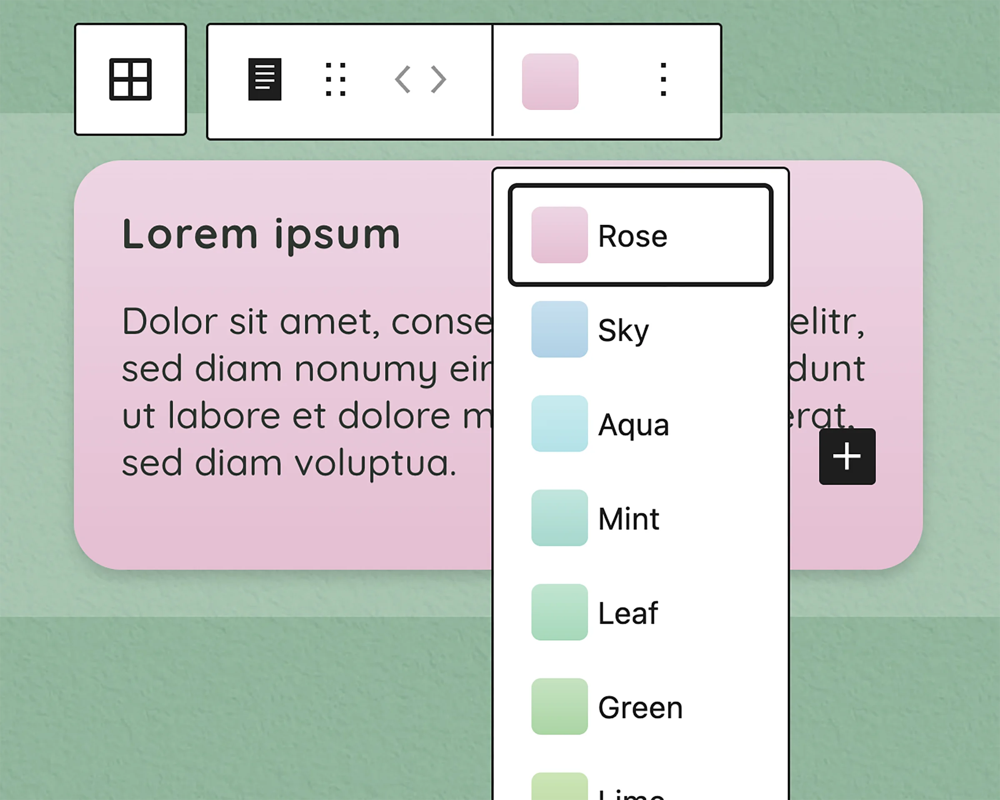

# UD Blocks: Betreuungsparadies

Custom Block-Plugin für die Website betreuungsparadies.ch.

Das Plugin stellt projektspezifische WordPress-Blöcke, Styles und Hilfsfunktionen für den Aufbau der Website bereit.

## Zweck

Das Plugin bündelt die individuellen Blöcke für betreuungsparadies.ch und trennt projektspezifische Funktionen sauber vom Theme.

Enthalten sind unter anderem Blöcke für:

- Inhaltskarten
- Kartengrid
- Karten-Buttons
- Chips
- Infobereiche
- Team-Darstellung
- Team-Loop
- Bildslider



## Technische Grundlage

Das Plugin ist als WordPress-Block-Plugin aufgebaut und verwendet:

- WordPress Block Editor
- React / JSX
- SCSS
- Webpack
- dynamische Blöcke mit PHP-Rendering
- projektbezogene globale Styles

Die kompilierten Dateien liegen im Verzeichnis `build/`.
## Struktur

```text
ud-betreuungsparadies-blocks/
├── build/
├── includes/
│   ├── block-register.php
│   ├── enqueue.php
│   ├── helpers.php
│   └── render.php
├── src/
│   ├── blocks/
│   ├── css/
│   ├── js/
│   └── utils/
├── block.json
├── package.json
├── package-lock.json
├── webpack.config.js
└── ud-betreuungsparadies-blocks.php
```

## Entwicklung

Abhängigkeiten installieren:

```bash
npm install
```

Entwicklungsmodus starten:

```bash
npm run start
```

Produktions-Build erstellen:

```bash
npm run build
```

## Styles

Die Styles sind in globale und blockbezogene SCSS-Dateien aufgeteilt.

Frontend-Styles gehören in die jeweiligen `frontend.scss`-Dateien.
Editor-Styles gehören nur dann in `editor.scss`, wenn sie ausschliesslich für die Darstellung im Editor benötigt werden.

Styles aus `frontend.scss` dürfen in `editor.scss` nicht nochmals dupliziert werden.

## Dynamische Blöcke

Einige Blöcke werden serverseitig gerendert. Die Ausgabe erfolgt über PHP-Dateien im Plugin.

Das betrifft insbesondere Blöcke, die Inhalte aus WordPress-Daten wie Custom Post Types, Taxonomien oder Meta-Feldern ausgeben.

## Team

Das Plugin enthält Funktionen und Blöcke für die Team-Darstellung.

Verwendet werden unter anderem:

* Custom Post Type `ud_team`
* Taxonomie `team_standort`
* Team-Meta-Felder wie E-Mail, Funktion und Leitungsstatus
* dynamische Ausgabe über den Team-Loop-Block

## Hinweise

Das Plugin ist projektspezifisch für betreuungsparadies.ch entwickelt und nicht als allgemein verwendbares WordPress-Plugin gedacht.

Änderungen an Blöcken, Styles oder Rendering-Logik sollten immer im Plugin vorgenommen werden, nicht direkt im Theme.

## Autor

[ulrich.digital gmbh](https://ulrich.digital)

## Lizenz

GPL v2 or later
[https://www.gnu.org/licenses/gpl-2.0.html](https://www.gnu.org/licenses/gpl-2.0.html)


