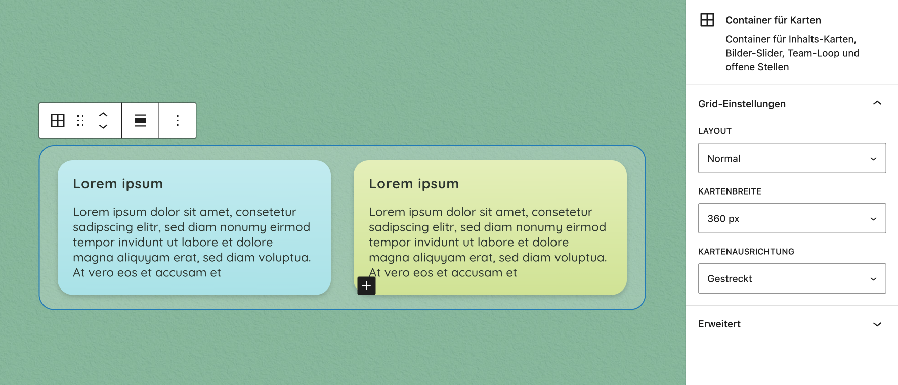
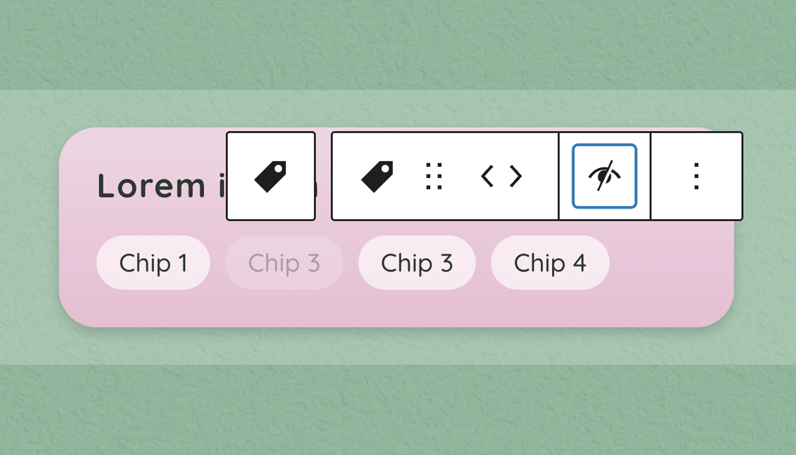
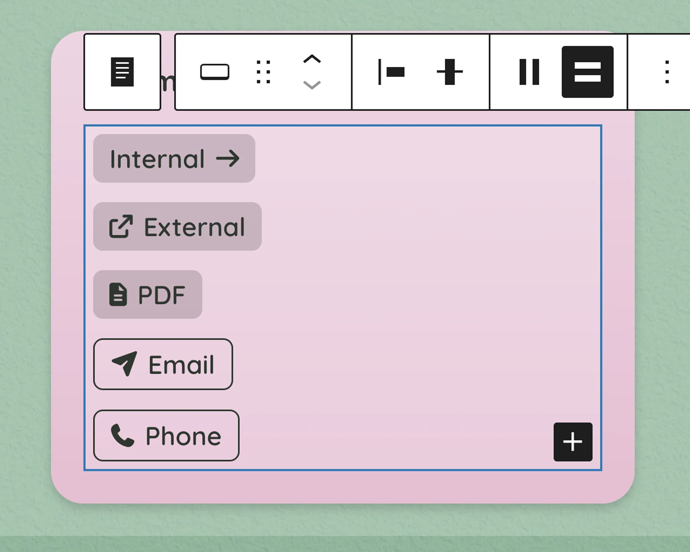
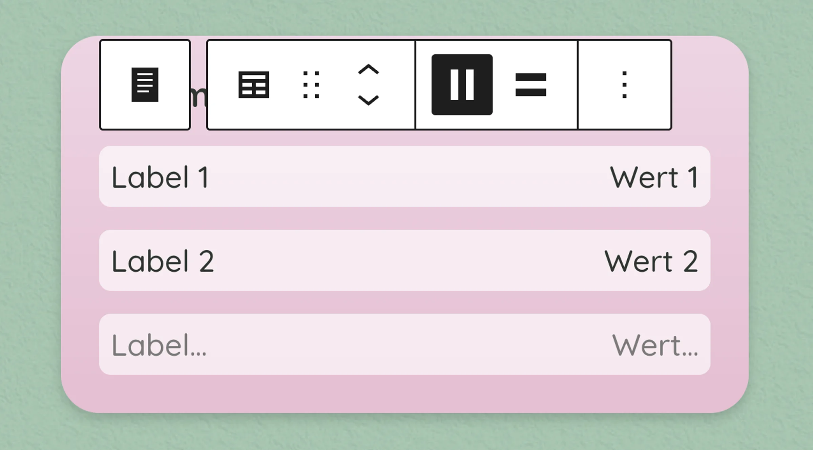

# UD Blocks: Betreuungsparadies

Block-Plugin für die Website betreuungsparadies.ch.

Das Plugin stellt mehrere WordPress-Blöcke, globale Styles und Hilfsfunktionen für den Aufbau der Website bereit.

## Zweck

Das Plugin bündelt alle individuellen Blöcke für betreuungsparadies.ch und hält Block-Logik, Styles und Rendering sauber vom Theme getrennt.

## Blöcke

### Karten-Container



*Der Karten-Container steuert Kartenbreite, Spalten und Layout.*

Container-Block für mehrere Inhaltsblöcke in einem flexiblen Kartenraster.

- erlaubt Inhaltskarten, Bildslider, Team-Loop, offene Stellen, wiederverwendbare Blöcke und Abstandshalter
- unterstützt die Layouts «Normal», «Masonry» und «Spaltenanzahl»
- bietet Einstellungen für Kartenbreite, Spaltenanzahl und Kartenausrichtung

### Inhaltskarte


*Die Inhaltskarte kann unterschiedliche Hintergrundfarben erhalten.*

Karten-Block für kompakte Inhaltsbereiche mit Text, Medien und optionalen weiterführenden Elementen.

- dient als flexible Karte für Titel, Text, Bilder, Buttons, Chips und Infobereiche
- unterstützt wählbare Hintergrundverläufe
- kann bei Bedarf eine eigene Kartenbreite erhalten

### Card Chips



*Chips können aktive und inaktive Zustände anzeigen.*

Block-Kombination für kurze, visuelle Status- oder Angebotsangaben innerhalb von Karten.

- der Container ordnet mehrere Chips flexibel und umbrechend an
- einzelne Chips enthalten einen frei editierbaren Text
- Chips können als aktiv oder inaktiv markiert werden

### Card Buttons



*Buttons zeigen den jeweiligen Linktyp visuell an.*

Block-Kombination für einen oder mehrere Buttons innerhalb von Karten.

- der Container ordnet Buttons horizontal oder vertikal an
- einzelne Buttons unterstützen Seite/URL, Datei/PDF, E-Mail und Telefon
- Button-Stil kann zwischen gefüllt und Kontur gewählt werden

### Info-Liste



Block für kurze, strukturierte Informationszeilen innerhalb von Karten oder Inhaltsbereichen.

- kombiniert eine Bezeichnung mit einem zugehörigen Wert
- eignet sich für Angaben wie Öffnungszeiten, Standort, Alter oder Kontaktinformationen
- unterstützt eine zweigeteilte oder gestapelte Darstellung

### Weitere Blöcke

Ergänzende Blöcke für bildstarke Bereiche, Stellenanzeigen und Team-Inhalte.

- Bildslider mit einzelnen Slides für visuelle Inhaltsbereiche
- Blöcke für offene Stellen inklusive passendem Button
- Team-Blöcke für Hero-Bereiche, Teamprofile und gefilterte Team-Übersichten

## Technische Grundlage

Das Plugin ist als WordPress-Block-Plugin aufgebaut und verwendet:

- WordPress Block Editor
- React / JSX
- SCSS
- Webpack
- dynamische Blöcke mit PHP-Rendering
- globale Styles

Die kompilierten Dateien liegen im Verzeichnis `build/`.

## Struktur

```text
ud-betreuungsparadies-blocks/
├── build/
├── includes/
│   ├── block-register.php
│   ├── enqueue.php
│   ├── helpers.php
│   └── render.php
├── src/
│   ├── blocks/
│   ├── css/
│   ├── js/
│   └── utils/
├── block.json
├── package.json
├── package-lock.json
├── webpack.config.js
└── ud-betreuungsparadies-blocks.php
```

## Entwicklung

Abhängigkeiten installieren:

```bash
npm install
```

Entwicklungsmodus starten:

```bash
npm run start
```

Produktions-Build erstellen:

```bash
npm run build
```

## Styles

Die Styles sind in globale und blockbezogene SCSS-Dateien aufgeteilt.

Frontend-Styles gehören in die jeweiligen `frontend.scss`-Dateien.

Editor-Styles gehören nur dann in `editor.scss`, wenn sie ausschliesslich für die Darstellung im Editor benötigt werden.

Styles aus `frontend.scss` dürfen in `editor.scss` nicht nochmals dupliziert werden.

## Dynamische Blöcke

Einige Blöcke werden serverseitig gerendert. Die Ausgabe erfolgt über PHP-Dateien im Plugin.

Das betrifft insbesondere Blöcke, die Inhalte aus WordPress-Daten wie Custom Post Types, Taxonomien oder Meta-Feldern ausgeben.

## Team

Das Plugin enthält Funktionen und Blöcke für die Team-Darstellung.

Verwendet werden unter anderem:

* Custom Post Type `ud_team`
* Taxonomie `team_standort`
* Team-Meta-Felder wie E-Mail, Funktion und Leitungsstatus
* dynamische Ausgabe über den Team-Loop-Block

## Hinweise

Das Plugin ist für den Einsatz auf betreuungsparadies.ch entwickelt und nicht als allgemein wiederverwendbares Plugin konzipiert.

Änderungen an Blöcken, Styles oder Rendering-Logik sollten immer im Plugin vorgenommen werden, nicht direkt im Theme.

## Autor

[ulrich.digital gmbh](https://ulrich.digital)

## Lizenz

GPL v2 or later
[https://www.gnu.org/licenses/gpl-2.0.html](https://www.gnu.org/licenses/gpl-2.0.html)