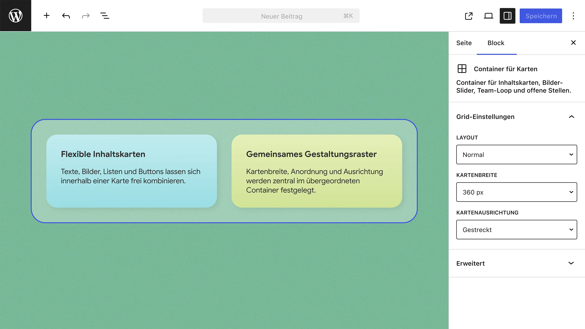
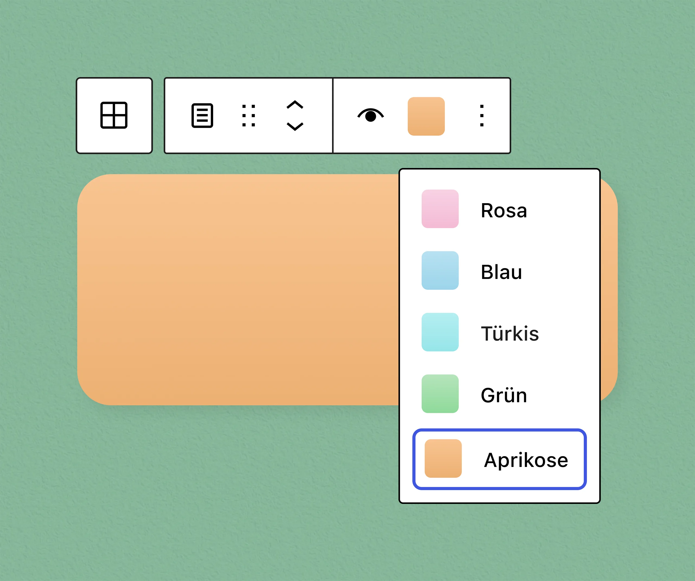
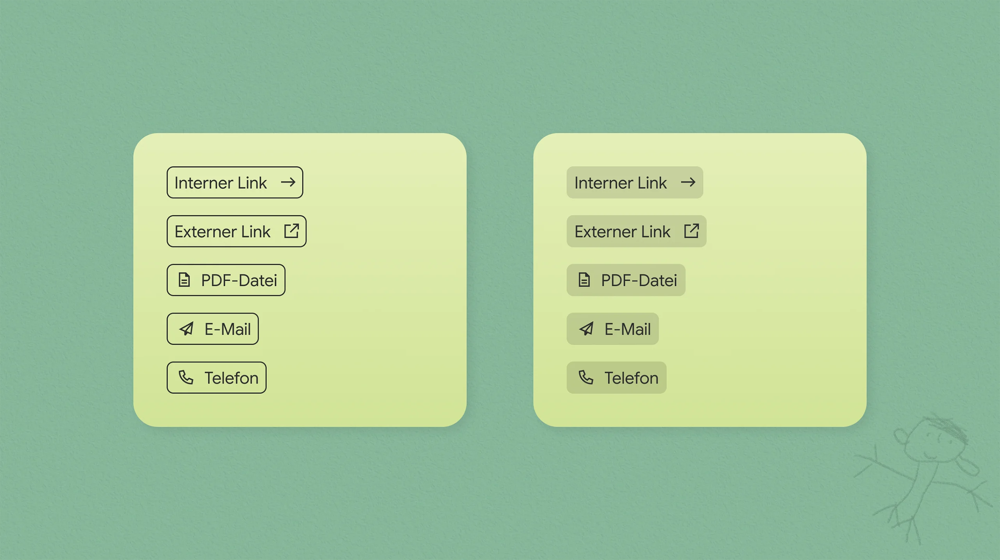
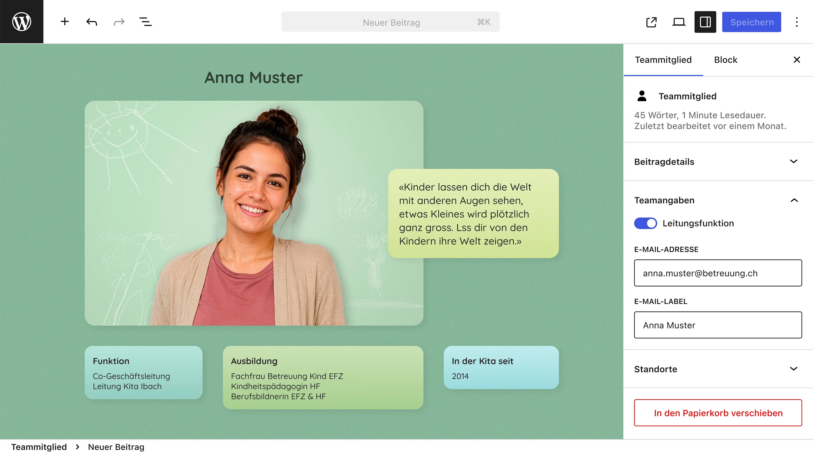
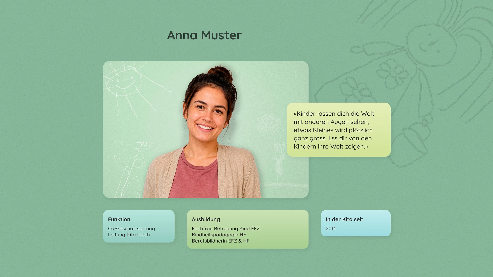

# UD Modular Content Blocks

Projektspezifisches WordPress-Plugin für ein modulares Redaktionssystem mit eigenen Gutenberg-Blöcken.

Das Plugin verbindet flexible Kartenraster, Inhaltskarten, strukturierte Angaben, Medien, Teamprofile und Stellenangebote. Block-Logik, Darstellung und dynamisches Rendering werden gemeinsam im Plugin gepflegt.

## Zweck

UD Modular Content Blocks stellt der Redaktion aufeinander abgestimmte Inhaltsbausteine bereit. Die einzelnen Blöcke bilden wiederkehrende Aufgaben gezielt ab und fügen sich im Editor und im Frontend zu einem gemeinsamen Gestaltungssystem zusammen.

Die Lösung wurde für den Webauftritt von [betreuungsparadies.ch](https://betreuungsparadies.ch) entwickelt.

## Karten-Container



*Der Karten-Container steuert Layout, Kartenbreite und Ausrichtung zentral.*

Der Karten-Container ordnet unterschiedliche Inhaltsbausteine in einem gemeinsamen Raster an.

- nimmt Inhaltskarten, Bildslider, Team-Loop, offene Stellen, wiederverwendbare Blöcke und Abstandshalter auf
- unterstützt die Layouts «Normal», «Masonry» und «Spaltenanzahl»
- bietet Einstellungen für Kartenbreite, Spaltenanzahl und Kartenausrichtung
- kann Karten am oberen Rand ausrichten oder auf eine gemeinsame Höhe strecken

## Inhaltskarte



*Über die Block-Werkzeugleiste erhält die Inhaltskarte einen der projektspezifisch definierten Farbverläufe.*

Die Inhaltskarte verbindet eine verlässliche gestalterische Form mit frei kombinierbaren Gutenberg-Blöcken.

- erlaubt Überschriften, Absätze, Listen, Bilder, Gruppen und weitere projektspezifische Blöcke
- stellt abgestimmte Farbverläufe zur Auswahl
- kann bei Bedarf eine eigene Kartenbreite erhalten
- besitzt einen direkt im Editor steuerbaren Sichtbarkeitsstatus

## Strukturierte Komponenten

Kleinere Komponenten bilden wiederkehrende Angaben und Verknüpfungen innerhalb der Inhaltskarten ab.

### Card Chips

- ordnen mehrere kurze Status- oder Angebotsangaben flexibel und umbrechend an
- enthalten einen direkt bearbeitbaren Text
- unterstützen einen aktiven und einen inaktiven Zustand

### Info-Liste

- verbindet eine Bezeichnung mit dem zugehörigen Wert
- eignet sich beispielsweise für Öffnungszeiten, Standorte, Altersangaben oder Kontaktinformationen
- unterstützt eine zweigeteilte und eine gestapelte Darstellung

### Card Buttons



*Interne und externe Links, Dokumente, E-Mail-Adressen und Telefonnummern erhalten jeweils das passende Symbol.*

- der Container ordnet mehrere Buttons horizontal oder vertikal an
- einzelne Buttons unterstützen Seite beziehungsweise URL, Datei beziehungsweise PDF, E-Mail und Telefon
- der Linktyp wird aus dem gepflegten Ziel abgeleitet
- der Button-Stil kann zwischen gefüllt und Kontur gewählt werden

## Teamprofile

Das Plugin ergänzt WordPress um einen eigenen Inhaltstyp für Teammitglieder. Eine vorbereitete Blockstruktur verbindet Portrait, persönlichen Inhalt, Funktion, Ausbildung und weitere Angaben zu einem einheitlich aufgebauten Profil.



*Profilinhalt, Leitungsfunktion, E-Mail-Adresse und Standort werden in einer gemeinsamen Editoransicht gepflegt.*

Zusätzliche Angaben wie E-Mail-Adresse, Leitungsfunktion und Standort werden strukturiert gespeichert. Der Team-Loop übernimmt die zentral gepflegten Profile in unterschiedliche Übersichten und kann sie nach Standort sowie Leitungsfunktion filtern.



*Die vorbereitete Inhaltsstruktur führt Portrait und persönliche Angaben zu einem konsistenten Teamprofil zusammen.*

## Weitere Blöcke

Ergänzende Blöcke erweitern das System um Medien und Stellenangebote.

- Bildslider mit einzeln gepflegten Slides
- vordefiniertes Bildergrid mit sieben Bildpositionen und WordPress-Lightbox
- frei befüllbare Karten für offene Stellen
- Fokus-Button, der auf aktive Stellenangebote reagiert
- Team-Hero und gefilterter Team-Loop

## Technische Grundlage

Das Plugin ist als WordPress-Block-Plugin aufgebaut und verwendet:

- WordPress Block Editor
- React und JSX
- SCSS
- Webpack
- InnerBlocks für verschachtelte Inhaltsstrukturen
- dynamische Blöcke mit PHP-Rendering
- Custom Post Type, Taxonomie und strukturierte Metadaten für Teamprofile
- Splide für den Bildslider

Die kompilierten Dateien liegen im Verzeichnis `build/`.

## Struktur

```text
ud-betreuungsparadies-blocks/
├── assets/
├── build/
├── includes/
│   ├── default-terms/
│   ├── meta/
│   ├── post-types/
│   ├── taxonomies/
│   ├── block-register.php
│   ├── enqueue.php
│   └── helpers.php
├── src/
│   ├── blocks/
│   ├── block-styles/
│   └── utils/
├── package.json
├── package-lock.json
├── webpack.config.js
└── ud-betreuungsparadies-blocks.php
```

## Entwicklung

Abhängigkeiten installieren:

```bash
npm install
```

Entwicklungsmodus starten:

```bash
npm run start
```

Produktions-Build erstellen:

```bash
npm run build
```

## Styles

Die Styles sind in globale und blockbezogene SCSS-Dateien aufgeteilt.

Frontend-Styles liegen in den jeweiligen `frontend.scss`-Dateien. `editor.scss` ergänzt ausschliesslich die Darstellung im Editor. Gemeinsame Werte und Gestaltungsvorgaben werden zentral im Plugin geführt.

## Dynamische Blöcke

PHP rendert diejenigen Blöcke, deren Ausgabe von aktuellen WordPress-Daten oder einem Sichtbarkeitsstatus abhängt. Dazu gehören insbesondere Team-Übersichten, Inhaltskarten, offene Stellen und die zugehörigen Fokus-Buttons.

## Einsatzbereich

Das Plugin ist als projektspezifische Lösung für betreuungsparadies.ch konzipiert. Änderungen an Blockstruktur, Styles und Rendering-Logik werden zentral in diesem Plugin gepflegt.

## Einblicke in die Umsetzung

Der Beitrag gibt Einblick in die entwickelte Lösung und ihre Funktionsweise. Das Projekt zeigt den konkreten Einsatz.

- **Mehr zur Lösung:** [Ein modulares Redaktionssystem mit eigenen Gutenberg-Blöcken entwickeln](https://ulrich.digital/ein-modulares-redaktionssystem-mit-eigenen-gutenberg-bloecken-entwickeln/)
- **Einblick ins Projekt:** [Struktur, die Freiraum schafft](https://ulrich.digital/referenzen/modulares-wordpress-system/)

## Autor

[ulrich.digital gmbh](https://ulrich.digital)

## Lizenz

Dieses Projekt steht unter der [ulrich.digital Nutzungslizenz 1.0](LICENSE).

Die unveränderte Software darf in eigenen und kommerziellen Projekten eingesetzt werden. Auf jeder öffentlich erreichbaren Website oder Anwendung muss [ulrich.digital gmbh](https://ulrich.digital) im Impressum, in einem Credits-Bereich oder auf einer vergleichbaren Informationsseite genannt werden. Verkauf, eigenständige Weitergabe, Unterlizenzierung und Änderungen bedürfen der vorherigen schriftlichen Zustimmung von ulrich.digital gmbh.

Komponenten Dritter behalten ihre jeweiligen Lizenz- und Nutzungsbedingungen.
